# 🎙️ Hindi Voice AI Agent


[](https://www.python.org/)
[](https://fastapi.tiangolo.com/)
[](LICENSE)

A state-of-the-art **Hindi Voice Agent** designed for real-time, natural conversations. Built on a robust three-provider specialized stack to ensure high accuracy, low latency, and emotional intelligence.

---

## 🚀 Key Features

*   **🗣️ Native Hindi ASR**: Powered by **Reverie Language Technologies**, optimized for Indian dialects and code-mixing (Hinglish).
*   **🧠 Intelligent Understanding**: Integrated with **Google Gemini** for context-aware, human-like responses.
*   **🔊 Hyper-Realistic TTS**: Utilizes **ElevenLabs** for emotionally resonant speech synthesis and voice cloning.
*   **⚡ Real-Time Latency**: WebSocket-based architecture ensures sub-second response times.
*   **🔌 Pluggable Architecture**: Easily swap out ASR, TTS, or LLM providers.

---

## 🏗️ Architecture

```mermaid
graph TD
    User([👤 User]) <-->|WebSocket Audio Stream| Server[🚀 FastAPI Server]
    
    subgraph "Core Services"
        Server <-->|Audio Chunk| ASR[🎤 Reverie ASR / Google STT]
        ASR -->|Transcribed Text| LLM[🧠 Google Gemini]
        LLM -->|Response Text| TTS[🔊 ElevenLabs TTS]
        TTS -->|Audio Stream| Server
    end
    
    style User fill:#f9f,stroke:#333,stroke-width:2px
    style Server fill:#bbf,stroke:#333,stroke-width:2px
    style ASR fill:#dfd,stroke:#333,stroke-width:2px
    style LLM fill:#fdd,stroke:#333,stroke-width:2px
    style TTS fill:#ddf,stroke:#333,stroke-width:2px
```



---

## 🛠️ Technology Stack

| Component | Provider | Why? |
| :--- | :--- | :--- |
| **ASR** (Speech-to-Text) | **Reverie** | Best-in-class Hindi accuracy & Hinglish support. |
| **Backup ASR** | **Google Cloud STT** | Reliability, multi-speaker detection & enterprise scale. |
| **LLM** (Intelligence) | **Google Gemini** | Advanced reasoning & multilingual capabilities. |
| **TTS** (Text-to-Speech) | **ElevenLabs** | Industry-leading naturalness & voice cloning. |
| **Backend** | **FastAPI** | High-performance, async Python web framework. |

---

## 🏁 Getting Started

### Prerequisites

*   Python 3.10+
*   API Keys for Reverie, Google Cloud, ElevenLabs, and Gemini.

### Installation

1.  **Clone the repository**
    ```bash
    git clone https://github.com/Pranay1301/Voice-Agent.git
    cd Voice-Agent
    ```

2.  **Create a virtual environment**
    ```bash
    python -m venv venv
    source venv/bin/activate  # On Windows: venv\Scripts\activate
    ```

3.  **Install dependencies**
    ```bash
    pip install -r requirements.txt
    ```

4.  **Configure Environment**
    Copy `.env.example` to `.env` and add your keys:
    ```bash
    cp .env.example .env
    ```

5.  **Run the Server**
    ```bash
    python main.py
    ```

---

## 🧪 Testing

Connect to the WebSocket endpoint to start a conversation:

`ws://localhost:8000/ws/conversation`

You can use a simple WebSocket client or the provided test script (coming soon).

---

## 📜 License

This project is licensed under the MIT License - see the [LICENSE](LICENSE) file for details.

---

<p align="center">
  Made with ❤️ for Hindi AI Innovation
</p>
