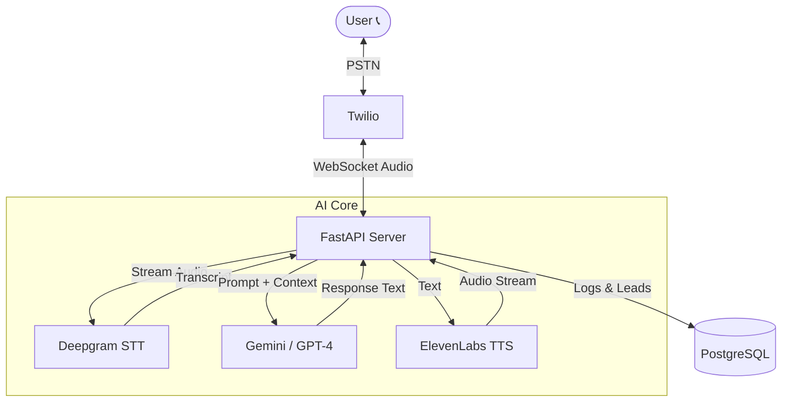

# CRTG Voice Agent


<div align="center">

[](https://www.python.org/)
[](https://fastapi.tiangolo.com/)
[](https://www.twilio.com/)
[](https://openai.com/)
[](https://deepgram.com/)
[](https://elevenlabs.io/)

**A next-generation multilingual voice agent for real estate sales, powered by Generative AI.**

[Features](#-features) • [Architecture](#-architecture) • [Getting Started](#-getting-started) • [Usage](#-usage) • [Contributing](#-contributing)

</div>

---

## 🚀 Features

- **🗣️ Real-time Transcription**: Ultra-low latency speech-to-text using **Deepgram Nova-2**.
- **🧠 Intelligent Conversations**: Powered by **Google Gemini 1.5 Flash** (or GPT-4) for natural, context-aware dialogue.
- **🎙️ Human-like Voice**: Crystal clear, emotive text-to-speech via **ElevenLabs**.
- **📞 Inbound & Outbound**: Seamlessly handle calls via **Twilio Programmable Voice**.
- **📝 Structured Logging**: Automatically logs call metadata, transcripts, and qualified leads to JSON.
- **⚡ WebSocket Streaming**: Full-duplex audio streaming for sub-second response times.

## 🏗️ Architecture



## 🛠️ Getting Started

### Prerequisites

- Python 3.10+
- [ngrok](https://ngrok.com/) (for local testing)
- API Keys: Twilio, Deepgram, ElevenLabs, Google Gemini

### Installation

1.  **Clone the repository**
    ```bash
    git clone https://github.com/Pranay1301/Voice-Agent.git
    cd Voice-Agent/crtg_voice_agent
    ```

2.  **Install dependencies**
    ```bash
    pip install -r requirements.txt
    ```

## 📂 Directory Structure

```text
crtg_voice_agent/
├── main.py            # FastAPI entry point & global error handling
├── inbound_call.py    # Handles Twilio WebSocket & conversation loop
├── outbound_call.py   # Script to initiate outbound calls
├── gpt_logic.py       # Logic for Gemini/GPT interaction & function calling
├── transcriber.py     # Deepgram STT integration
├── tts_engine.py      # ElevenLabs TTS integration
├── database.py        # Async database connection setup
├── models.py          # SQLAlchemy models (CallLog, CallTurn)
├── config.py          # Pydantic settings & env validation
├── inputs/            # (Optional) Pre-recorded audio for testing
├── logs/              # (Deprecated) Local JSON logs
└── utils/
    └── logger.py      # Async logging service
```

## ⚙️ Configuration

Copy `.env.example` to `.env` and fill in the following:

| Variable | Description |
| :--- | :--- |
| `TWILIO_ACCOUNT_SID` | Your Twilio Account SID |
| `TWILIO_AUTH_TOKEN` | Your Twilio Auth Token |
| `TWILIO_PHONE_NUMBER` | Your purchased Twilio phone number |
| `GEMINI_API_KEY` | Google Gemini API Key |
| `ELEVENLABS_API_KEY` | ElevenLabs API Key |
| `ELEVENLABS_VOICE_ID` | Voice ID (e.g., `21m00Tcm4TlvDq8ikWAM` for Rachel) |
| `DEEPGRAM_API_KEY` | Deepgram API Key |
| `DATABASE_URL` | Postgres connection string (e.g., `postgresql+asyncpg://...`) |


## 🏃 Usage

### Local Development
```bash
uvicorn main:app --reload
```

### Docker Deployment
1.  **Build the image**
    ```bash
    docker build -t voice-agent .
    ```
2.  **Run the container**
    ```bash
    docker run --env-file .env -p 8000:8000 voice-agent
    ```

## 📊 Logging & Database

Calls are logged to the database defined in `DATABASE_URL`.
- **Tables**: `call_logs`, `call_turns`
- **ORM**: SQLAlchemy + AsyncPG

## 🏥 Health Check

Endpoint: `GET /health`
Response: `{"status": "ok"}`

## 🔧 Troubleshooting

- **Twilio 11100 Error**: Usually means the webhook URL is unreachable. Ensure `ngrok` is running and the URL is updated in Twilio Console.
- **WebSocket Disconnects**: Check if Deepgram/ElevenLabs API keys are valid. Invalid keys often cause immediate closure.
- **Database Connection**: Ensure your `DATABASE_URL` is correct and the Postgres server is accessible from the container or local machine.
- **Latency**: If response is slow, check your internet connection or switch to a closer region for servers.

## 💡 Technical Details & Learnings

### 🔧 Key Implementation Details
- **Architecture**: We switched from a simple file-based logging system to a robust **PostgreSQL** architecture using **SQLAlchemy** (ORM) and **AsyncPG** (driver). This allows for scalable, concurrent write operations without blocking the main event loop.
- **Resilience**: A global exception handler (`@app.exception_handler`) ensures the FastAPI server never crashes from unhandled errors. Critical external calls (Twilio, Deepgram, LLM) are wrapped in `try/except` blocks to degrade gracefully (e.g., log error but keep connection alive).
- **Concurrency**: The system heavily relies on Python's `asyncio` to handle simultaneous WebSocket streams (Audio I/O) and database writes.

### 🧠 Lessons Learned
- **Latency is King**: Handling audio streams requires non-blocking code. Any synchronous operation (like standard `requests` or blocking DB calls) would stutter the audio.
- **State Management**: Managing conversation state across HTTP (Webhooks) and WebSockets is complex. We used `stream_sid` as the unique key to tie disparate events (Call Start -> Audio Stream -> DB Log) together.
- **Environment Consistency**: "It works on my machine" is solved by Docker. Encapsulating system-level dependencies (like `ffmpeg` or specific Python versions) ensures smooth deployment.

### 🔮 Future Improvements
- **Interruption Handling**: Implement "barge-in" to stop TTS immediately when the user speaks.
- **Function Calling**: Expand the Gemini toolset to allow the agent to schedule appointments or send emails directly.

---

<div align="center">
  <sub>Built with ❤️ by CRTG AI</sub>
</div>
