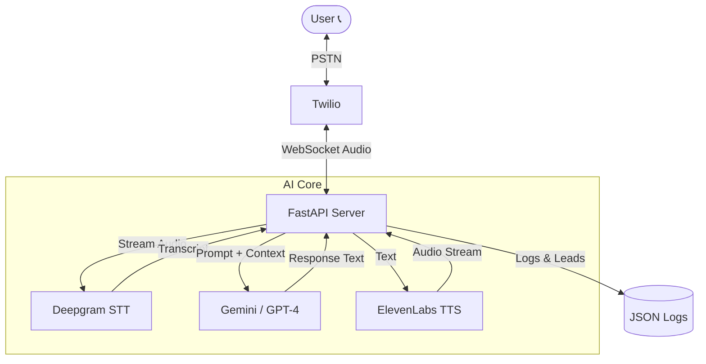

# CRTG Voice Agent


<div align="center">

[](https://www.python.org/)
[](https://fastapi.tiangolo.com/)
[](https://www.twilio.com/)
[](https://openai.com/)
[](https://deepgram.com/)
[](https://elevenlabs.io/)

**A next-generation multilingual voice agent for real estate sales, powered by Generative AI.**

[Features](#-features) • [Architecture](#-architecture) • [Getting Started](#-getting-started) • [Usage](#-usage) • [Contributing](#-contributing)

</div>

---

## 🚀 Features

- **🗣️ Real-time Transcription**: Ultra-low latency speech-to-text using **Deepgram Nova-2**.
- **🧠 Intelligent Conversations**: Powered by **Google Gemini 1.5 Flash** (or GPT-4) for natural, context-aware dialogue.
- **🎙️ Human-like Voice**: Crystal clear, emotive text-to-speech via **ElevenLabs**.
- **📞 Inbound & Outbound**: Seamlessly handle calls via **Twilio Programmable Voice**.
- **📝 Structured Logging**: Automatically logs call metadata, transcripts, and qualified leads to JSON.
- **⚡ WebSocket Streaming**: Full-duplex audio streaming for sub-second response times.

## 🏗️ Architecture



## 🛠️ Getting Started

### Prerequisites

- Python 3.10+
- [ngrok](https://ngrok.com/) (for local testing)
- API Keys: Twilio, Deepgram, ElevenLabs, Google Gemini

### Installation

1.  **Clone the repository**
    ```bash
    git clone https://github.com/Pranay1301/Voice-Agent.git
    cd Voice-Agent/crtg_voice_agent
    ```

2.  **Install dependencies**
    ```bash
    pip install -r requirements.txt
    ```

3.  **Configure Environment**
    Copy `.env.example` to `.env` and fill in your keys:
    ```bash
    cp .env.example .env
    ```
    ```properties
    TWILIO_ACCOUNT_SID="your_sid"
    TWILIO_AUTH_TOKEN="your_token"
    GEMINI_API_KEY="your_key"
    ELEVENLABS_API_KEY="your_key"
    DEEPGRAM_API_KEY="your_key"
    ```

## 🏃 Usage

### 1. Start the Server
```bash
uvicorn main:app --reload
```

### 2. Expose to Internet
```bash
ngrok http 8000
```

### 3. Configure Twilio
Update your Twilio Phone Number's **Voice Webhook** to:
`https://<your-ngrok-url>/incoming-call`

### 4. Make a Call
- **Inbound**: Call your Twilio number.
- **Outbound**:
  ```bash
  python outbound_call.py <target_number> https://<your-ngrok-url>
  ```

## 📊 Logging

Calls are logged in `logs/` with structured JSON data:

```json
{
  "stream_sid_...": {
    "status": "active",
    "turns": [
      { "role": "user", "text": "I want to buy a villa." },
      { "role": "assistant", "text": "Sure, what is your budget?" }
    ],
    "lead_info": {
      "name": "John Doe",
      "budget": "5M AED"
    }
  }
}
```

## 🤝 Contributing

Contributions are welcome! Please feel free to submit a Pull Request.

---

<div align="center">
  <sub>Built with ❤️ by CRTG AI</sub>
</div>
